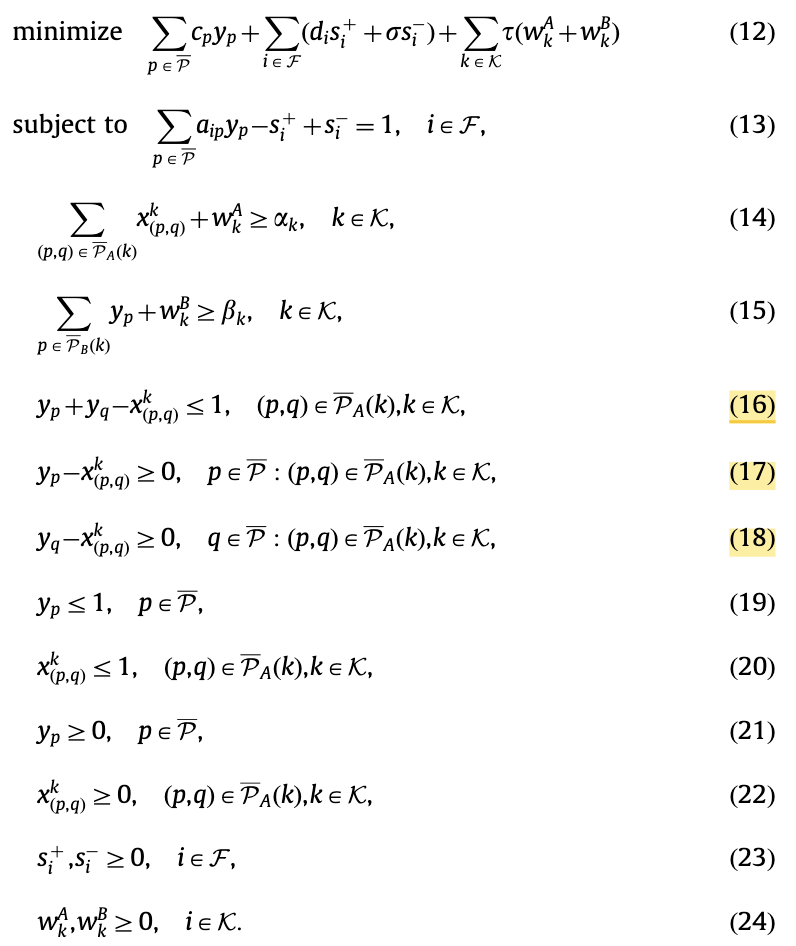

## How to pass the primal problem to the dual problem

Taken an example from the paper https://www.sciencedirect.com/science/article/pii/S0305054810002753

### STEP 1 Match Objective Terms

In the primal, the objective includes terms with $y_p, s^+_i, s^-_i, w^A_k, w^B_k$ , each of these variables will generate a dual constraint in the dual problem

### STEP 2 Map Constraints->Dual variables

For each primal constraint, a dual variable is generated:

$u_i, z^A_k,z^B_k,\delta^1_{(p,q),k},\delta^2_{(p,q),k}, \delta^3_{(p,q),k},\gamma^y_p,\gamma^x_{(p,q),k}$

- (13) equality -> $u_i$ is free
- (14)$\geq$ ->$z^A_k\leq0$
- (15)$\geq$->$z^B_k\leq0$ 
- (16)$\leq$ ->$\delta^1_{(p,q),k}\geq0$
- (17)$\geq$ ->$\delta^2_{(p,q),k}\leq0$
- (18)$\geq$ ->$\delta^3_{(p,q),k}\leq0$
- (19)$\leq$->$\gamma^y_p\geq 0$
- (20)$\leq$->$\gamma^x_{(p,q),k}\geq 0$

### STEP 3 Dual Objective

The dual objective collects the RHS (right-hand sides) of the primal constraints, weighted by their dual variables.

- (13): RHS =1 ->$\sum_iu_i$
- (14): RHS=$\alpha_k$-> $\sum_k\alpha_kz^A_k$ 
- (15): RHS=$\beta_k$->$\sum_k\beta_kz^B_k$
- (16): RHS=1->$\sum_{(p,q),k}\delta^1_{(p,q),k}$ 
- (19): RHS=1->$\sum_p \gamma^y_p$
- (20): RHS=1->$\sum_{(p,q),k}\gamma^x_{(p,q),k}$

### STEP 4 Dual Constraints

Each primal variable gives a dual constraint: for each primal variable, take all constraints in which it appears, multiply each constraint's coefficient by the corresponding dual variable, sum them up, and compare to the variable's objective coefficient.

#### $y_p$  

- (13)-> Coefficient $a_{ip}$, dual variable $u_i$(Free) , contribution $\sum_{i\in F}a_{ip}u_i$ 

- (15)-> Coefficient $1 \text{ if } p \in P_B(k)$ , dual variable $z^B_k\leq0$ , contribution $\sum_{k:p\in P_B(k)}z^B_k$ 

- (17)-> Coefficient  $1 \forall (p,q)\in \bar{P_A(k)}$ , dual variable $\delta^2_{(p,q),k}\leq0$ 

- (18)->Coefficient  1 $\forall (p,q) \text{ where } q=p$, dual variable $\delta^3_{(q,p),k}\leq0$, contribution $\sum_k\sum_{(q,p)\in\bar{P_A(k)}\delta^3_{(q,p),k}}$ 

- (19)->Coefficient 1, dual variable $\gamma^y_p \geq0$, contribution  $\gamma^y_p$ 

- Therefore the constraint :

  

### Finally the dual problem 

