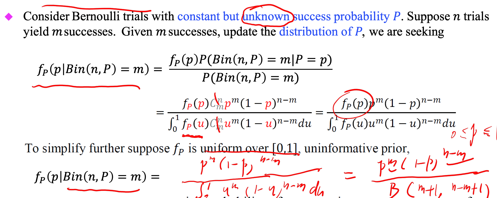

**Cantor set** : closed, uncountable, has no intervals, total "length"(Lebesgue measure) is 0.

The set is built start from the interval [0,1].

1. Remove the open middle thirs (1/3, 2/3), keep the two closed pieces
2. From each of those, remove their middle third:
3. Repeat forever

**Base-3**\/ternary: way of writing numbers - like decimal(base-10)/binary(base-2)

Ann non-negative real x can be written as 

$$x=d_0d_1d_2...$$(Base 3) , which means that :

$$x=d_03^0+d_13^{-1}+...$$ 
$$
\begin{array}{lll}
\text{number} & \text{base-3} & \text{check}\\
5 & 12_{3} & 1\cdot 3^{1}+2\cdot 3^{0}=5\\
\frac{1}{3} & 0.1_{3} & 1\cdot 3^{-1}=\frac{1}{3}\\
\frac{2}{9} & 0.02_{3} & 0\cdot 3^{-1}+2\cdot 3^{-2}=\frac{2}{9}\\
\frac{5}{9} & 0.12_{3} & 1\cdot 3^{-1}+2\cdot 3^{-2}=\frac{5}{9}
\end{array}
$$

<u>Relation to the Cantor set</u> 

A point $x\in [0,1]$ is in the **Cantor set** iff its base-3 expansion

$$x=0.a1a2a3...\quad(a_k\in{0,1,2})$$

contains only 0's and 2's .

**Lebesgue measure**

is the standard way of assigning a **length/area/volumne** to sets in $\mathbb{R}^n$ 

-  For interval $[a,b]$, their length b-a
- For rectangles in $\mathbb{R}^2$ , the area
- For nice sets(finite unions of intervals, polygons, balls,etc), matches the usual geometric size.

Given a set $E\subseteq \mathbb{R}$, it's outer Lebesgue measure is :

$$m^{\star}(E)=\infty\{\sum^{\infty}_{k=1}(b_k-a_k):E\subseteq(a_k,b_k)\}$$

=> cover $E$ by countably many open intervals, add up their lengths, and take the infimum over all covers.

$$\text{Set} E\quad \text{Lebesgue measure } m(E)$$

**Singular continuous function **

Continuous functions that increase only over sets whose total length is zero-Lebesgue measure is 0.

**PDF** possibility distribution function 

**CDF** cumulative distribution function is defined as

$$F(a)=P(X\leq a)$$

And we often derive a density, which is the PDF:

$$F(x)=\int^x_{-\infty}f(t)d_t$$

**However**,  a given **F** doesn't determine *f* uniquely:

E.g. $f_0(x)=1 \quad \forall 0\leq x\leq 1$ 

We can generate similar functions:

$f_a(x)=f0(x)+a\mathbb{1}_{x=a}\quad \forall 0\leq a\leq 1$

We have $\int^x_{-\infty}f_a(u)du = \int^x_{-\infty}f_0(u)du=1=F(x)$ as the alteration of countably many points do not affect the integral

**Expected value** $E(x)=\int_{x}xf_x(x)dx$  

**The k-th moment** $E(x^k)=\int_xx^kf_x(x)^kdx$ 

**Variance** $V(X)=E(X^2)-E(X)^2$ 

#### Indpendent 

if two variables are independent, then 

- $$E(x_1+x_2)=E(x_1)+E(x_2)$$
- $V(x_1+x_2)=V(x_1)+V(x_2)$
- $P(x_1\leq a,x_2\leq b)=P(x_1\leq a)P(x_2 \leq b)$

**Uniform random variable** 

$U(x_u,x_o)$ uniform random variable over $[x_u, x_o]$ 

**PDF** :

PDF:

$$
\text{Since } P(a\le X\le a+\delta)
   = P(b\le X\le b+\delta),
\quad
\text{the density must be constant on } [x_u,x_o].
$$

$$
1 = F(x_o) - F(x_u)
   = \int_{x_u}^{x_o} c\,du
   = c(x_o - x_u)
\qquad\Rightarrow\qquad
f(u)
   = \mathbb{1}_{\{x_u \le u \le x_o\}}
     \frac{1}{x_o - x_u}
$$

$$
E\big[U(x_u,x_o)\big]
   = \int_{x_u}^{x_o}
        u\;
        \mathbb{1}_{\{x_u \le u \le x_o\}}
        \frac{1}{x_o - x_u}\,du
   = \frac{u^2}{2(x_o-x_u)}
       \Big|_{x_u}^{x_o}
   = \frac{x_o + x_u}{2}
$$

**Exponential random variable** 

$X$ is said to be exponentially distributed with **rate parameter** $\lambda>0$ if the pdf is

$$X\sim Exp(\lambda) \quad f_X(x)=\lambda e^{-\lambda x}, x\geq0; 0 \text{ ow.}$$

A random variable $X$ take values between $0$ and $\infty$, the probability of $X$ being in any subintevak if $[a,a+\sigma]$ decrease exponentially as $a$ increases

**CDF** 

$$F_X(x)=\int^x_0f_X(x)d_x =-e^{-\lambda x}|^x_0=(1-e^{-\lambda x})$$ for x>=0

**PDF** 

$$f_x(X)=\lambda e^{-\lambda x}$$ for x>=0

## How to calculate the expectation of non-negative random variable

$$\mathbb{E}(x)=\int^{\infty}_0 xf_X(x)dx$$

By applying the integration by parts method, we set: $u = x, dv=f_X(x)dx$ 

Therefore, we have also:

$$\mathbb{E}(x)=\int^{\infty}_0 xf_X(x)dx=-x(1-F_X(x))|^{\infty}_0-\int^{\infty}_0(F_X(x)-1)dx$$ 

And the first part $-x(1-F_X(x))|^{\infty}_0$ converge to 0 as x increases, therefore:

$$\mathbb{E}(x)=\int^{\infty}_0(1-F_X(x))dx$$ 

As we have $F_X(x)=1-e^{-\lambda x}$

$$\mathbb{E}(x)=\int^{\infty}_0e^{-\lambda x}dx=0-(-\frac{1}{\lambda})=\frac{1}{\lambda}$$  

$\mathbb{E}(x^2)=\frac{2}{\lambda}$

Therefore $V(x)=\frac{1}{\lambda}$

We have $\mathbb{E}(x^k)=\frac{k!}{\lambda^k}$ . 

**Proof** tobe done......

- Expoential distribution has memoryless property:

  $$P(x\geq a+b)=P(x\geq a)P(x\geq b)$$

  Since $P=1-e^{\lambda x}$

  $$1-(1-e^{\lambda (a+b)})=(1-(1-e^{\lambda a}))(1-(1-e^{\lambda b})) $$

  $$e^{\lambda (a+b)}=e^{\lambda a}e^{\lambda b}$$

**Erlang random variable** 

is the sum of an integer number of exponential random variables.

**EX** Add up two independent $X_1$ $X_2\sim Expo(\lambda)$, what is the cdf of $X=X_1+X_2$  

$$f_{X1X2}(u,v)=\lambda e^{-\lambda u}\lambda e^{-\lambda v}$$ beacause of the independence .

$$P_{X1X2}(u+v<x)=\int^x_0\int^{x-u}_0 \lambda e^{-\lambda u}\lambda e^{-\lambda v}dvdu=\int^x_0 \lambda e^{-\lambda u}\int^{x-u}_0 e^{-\lambda v}dvdu$$ 

$$=\int^x_0 \lambda e^{-\lambda u}(1- e^{-\lambda (x-u)})du=\int^x_0 \lambda e^{-\lambda u}du-\int^x_0\lambda e^{-\lambda x}du=1-e^{-\lambda x}-\lambda xe^{-\lambda x}$$

$$=1-(1+\lambda x)e^{-\lambda x},\forall x\geq 0$$ 

$$Erlang(2,\lambda)$$

$$f_X(x)=\lambda e^{-\lambda x} - (\lambda e^{-\lambda x} -\lambda^2 x e^{-\lambda x})=\lambda^2 x e^{-\lambda x}$$ 

Sum of \(k\) independent r.v.s:

$$
\frac{\lambda^{k} x^{k-1} e^{-\lambda x}}{(k-1)!}
$$

**Gamma Function** 

Sum of $\alpha$ independent $Expo(\lambda)$ has a distribution parameterized by $(\alpha, \lambda)$ 

$$f_X(x)=\frac{\lambda e^{-\lambda x}(\lambda x)^{\alpha-1}}{\Gamma(\alpha)}$$ 

We define the Gamma Function as:

$$\Gamma(n)=\int^{\infty}_0 x^{n-1}e^{-x}dx$$

Then we have :

$$\Gamma(n+1)=\int^{\infty}_0x^ne^{-x}dx=x^{n-1}(-e^{-x})|^{+\infty}_0 +\int^{\infty}_0 nx^{n-1}e^{-x}dx=0+nT(n)$$

$$\Gamma(1)=1, \Gamma(2)=1\cdot\Gamma(1)=1$$

$$\Gamma(3)=2, \Gamma(4)=3\cdot 2$$

$$\Gamma(n)=(n-1)!$$ 

$$\Gamma(\frac{1}{2})^2 =\pi$$ 

**Beta Function** 

$$B(m,k)=\int^1_0 u^{m-1}(1-u)^{k-1}du=\int^1_0u^{k-1}(1-u)^{m-1}du=B(k,m)$$

- $B(k,m)=\frac{\Gamma(k)\Gamma(m)}{\Gamma(k+m)}$

**Prior** : starting guess/background knowledge

**LIkelyhood** : how well each p explained the observed outcome

**Posterior**: what you believe after seeing the data

$$\text{Posterior}(p)=\frac{\text{Prior}(p)\times \text{Likelihood}(p) }{\text{Evidence}}$$ 

Therefore, we have Beta random variable:

$$f_X(x)=\frac{x^{\alpha-1}(1-x)^{\lambda-1}}{B(\alpha,\lambda)}, \text{for } 0\leq x\leq1, \alpha,\lambda>0$$ ->Beta rv with a-1 successes and $\lambda -1$ failures

$\mathbb{E}(x)=\int^1_0 x\cdot \frac{x^{\alpha-1}(1-x)^{\lambda-1}}{B(\alpha,\lambda)}= \frac{B(\alpha+1,\lambda)}{B(\alpha,\lambda)}= \frac{\Gamma(\alpha +1)\Gamma(\lambda)\Gamma(\alpha+\lambda)}{\Gamma(\alpha+1+\lambda)\Gamma(\alpha)\Gamma(\lambda)}=\frac{\alpha}{\alpha+\lambda}$  

We have the expected value of probability of success is :

$$\frac{\alpha}{\alpha+\lambda}=\frac{\text{nbsuccesses}+1}{\text{nbtrials}+2}\neq \frac{\text{nbsuccesses}}{\text{nbtrials}}$$

### Normal distribution 

$$f_X(x)=\frac{1}{\sqrt{2\pi}\sigma }e^{\frac{-(x-\mu)^2}{2\sigma^2}}$$

$$\mathbb{E}(x)=\mu$$ 

If $X$ is $Normal(\mu,\sigma^2)$ ,$aX+b \sim Normal(a\mu+b,a^2\sigma^2)$

### Lognormal Random Variable

$X$ is lognormal random variable if $X=e^{Y} \text{ for }Y\sim Normal(\mu,\sigma^2)$ 

**Leibniz-rule** 

**cdf**

$$P(X\leq x)=P(Y\leq ln x)=\int^{lnx}_{-\infty}\frac{1}{\sqrt{2\pi}\sigma}e^{-\frac{(y-u)^2}{2\sigma^2}}dy$$

**pdf**

$$f_X(x)=\frac{d}{dx}P((X\leq x))=\frac{1}{\sqrt{2\pi}\sigma}e^{-\frac{(lnx-u)^2}{2\sigma^2}}\frac{1}{x}$$=